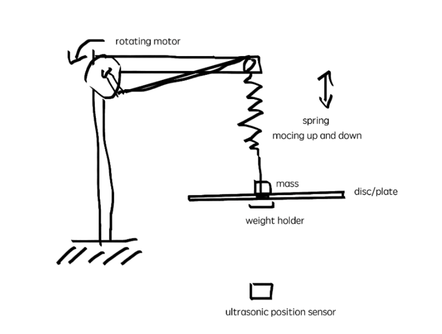
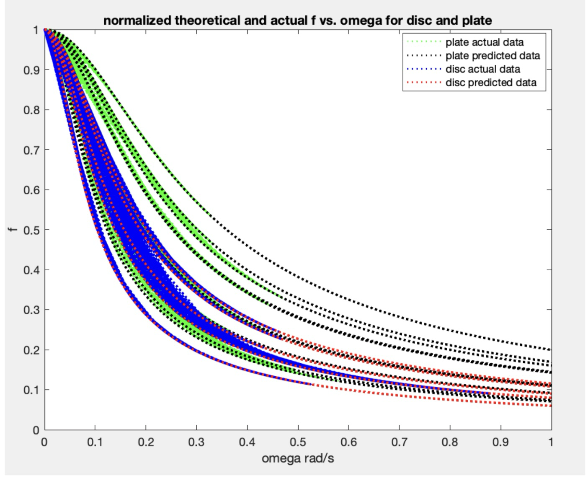
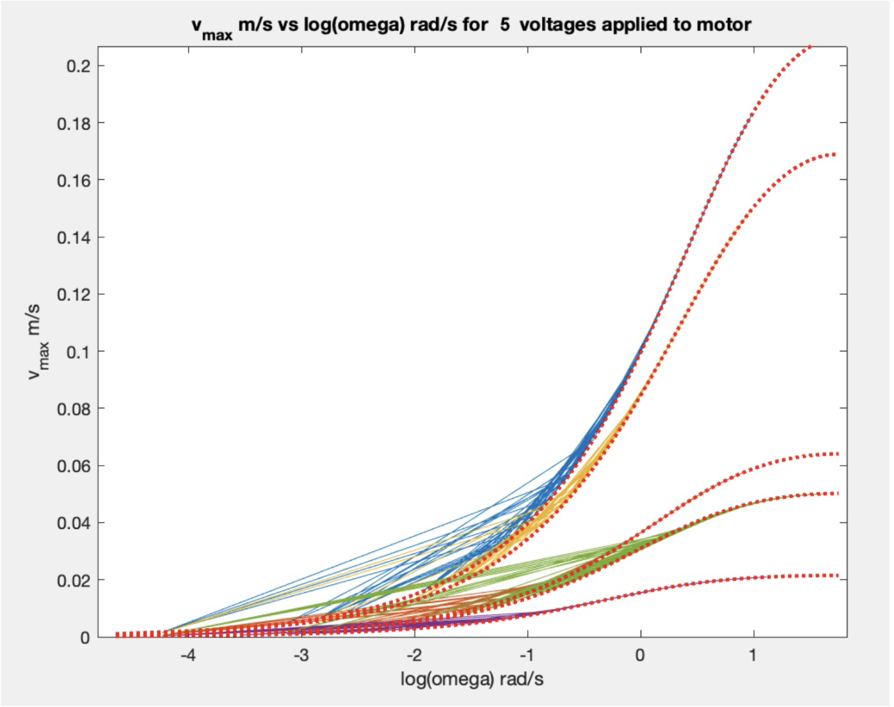

# Forced-Oscillation Test & Data Analysis in MATLAB

MATLAB analysis of a motor-driven spring–mass system measured with an ultrasonic position sensor. The project turns raw time-series measurements into engineering quantities used to characterize dynamic systems: natural frequency, damping, amplitude response, velocity response, phase lag, and quality factor.

## Engineering relevance

This project demonstrates an end-to-end experimental workflow relevant to **hardware test, validation, instrumentation, and data-acquisition roles**:

- Collected position data from a physical electromechanical system using an **ultrasonic sensor and Logger Pro**.
- Evaluated the system under **free and motor-driven oscillation** across multiple drive settings.
- Used MATLAB to clean, organize, analyze, and visualize repeated time-series measurements.
- Compared measured behavior with a second-order mass–spring–damper model.
- Quantified error and identified a test limitation: measurements taken only after stabilization excluded part of the initial transient response.

## Test setup


A rotating motor arm periodically drives a hanging spring–mass oscillator. Position is recorded by an ultrasonic sensor while the damping configuration and motor voltage are varied.

| Configuration | Purpose | Driven trials | Acquisition settings |
| --- | --- | ---: | --- |
| Large damping disc | High-damping response | 5 motor voltages | 20 s at 30 samples/s (600 samples/trial) |
| Small paper plate | Lower-damping response | 11 motor voltages | 10 s at 20 samples/s (200 samples/trial) |
| Mass only | Near-undamped comparison | 1 driven trial | Position response vs. time |

**Signal path:** motor-driven oscillator → ultrasonic position sensor → Logger Pro → MATLAB analysis

## Analysis performed

The scripts automate the main stages of the test-data workflow:

1. Import raw position-versus-time data from repeated trials.
2. Characterize free oscillation and estimate the natural angular frequency, \(\omega_0\).
3. Analyze driven response across the tested motor settings.
4. Compute and compare:
   - displacement amplitude vs. drive frequency;
   - maximum velocity vs. drive frequency;
   - phase shift between the drive and measured response;
   - damping coefficient \(R\), damping rate \(\gamma\), and quality factor \(Q\);
   - normalized response curves for comparison across configurations.
5. Propagate measurement uncertainty through calculated quantities.
6. Generate reproducible plots for comparison with the theoretical response.

<!-- FIGURE 6: Insert the measured vs. theoretical velocity-response plot here.
Suggested Markdown:


*Measured maximum-velocity response for five motor-voltage trials (solid lines) compared with the modeled response (dotted lines).*
-->

The analysis is based on the driven damped-oscillator model

\[
m\ddot{x} + R\dot{x} + kx = F_0\sin(\omega t).
\]

## Representative results

- Measured natural frequencies agreed closely with theoretical values in validation trials:
  - **5.946 rad/s measured vs. 5.915 rad/s expected** for the large-disc configuration;
  - **7.101 rad/s measured vs. 6.989 rad/s expected** for a mass-only free-oscillation case;
  - **5.648 rad/s measured vs. 5.680 rad/s expected** for the driven mass-only case.
- The large disc produced stronger damping than the paper plate, with summarized damping rates of **11.679 s⁻¹** and **8.606 s⁻¹**, respectively.
- Experimental amplitude, velocity, and phase trends were compared against the theoretical frequency response.
- The analysis exposed high sensitivity in calculated damping values when velocity approached zero, showing how derivative-based quantities can amplify measurement uncertainty.
- A systematic test limitation was documented: starting acquisition after the motion stabilized reduced coverage of the early transient and higher-frequency behavior.


## Repository contents

| File | Description |
| --- | --- |
| `disc_analysis.m` | Analysis for the large damping disc: free response plus 5 driven motor-voltage trials |
| `plate_analysis.m` | Analysis for the paper plate: free response, 11 driven trials, and a mass-only comparison |
| `partA*.txt`, `partB1-*.txt` | Lab 7 free- and driven-oscillation data |
| `partf*.txt`, `partg*.txt` | Lab 8 free, driven, and mass-only data |

The raw `.txt` measurements are not included in this repository; the scripts expect the original lab-data files to be placed in the working directory.

## Tools and skills demonstrated

`MATLAB` · `time-series analysis` · `sensor data acquisition` · `experimental validation` · `signal visualization` · `uncertainty propagation` · `dynamic-system modeling` · `technical documentation`

## Running the analysis

1. Place the original measurement files in the same directory as the MATLAB scripts.
2. Open the directory in MATLAB.
3. Run the appropriate script:

```matlab
disc_analysis
plate_analysis
```

Each script loads its corresponding trials, computes the response parameters, and generates the analysis figures.

## Scope

This was a Rutgers University Physics 326 laboratory project. The work in this repository focuses on experimental data analysis and model validation; it does not claim design of the motor, sensor, or data-acquisition hardware.
